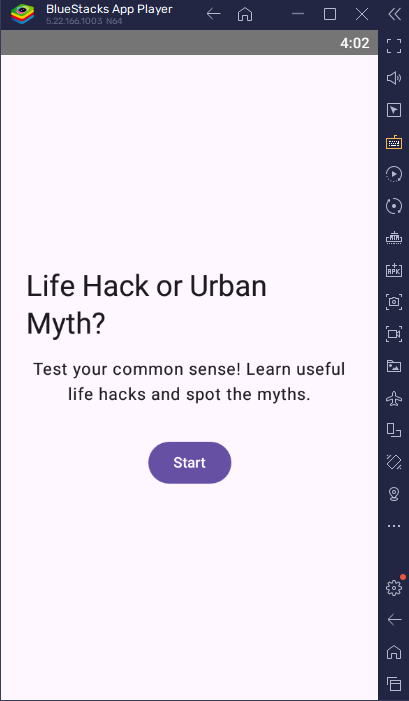
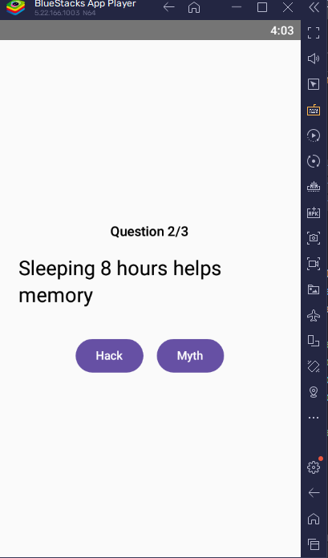
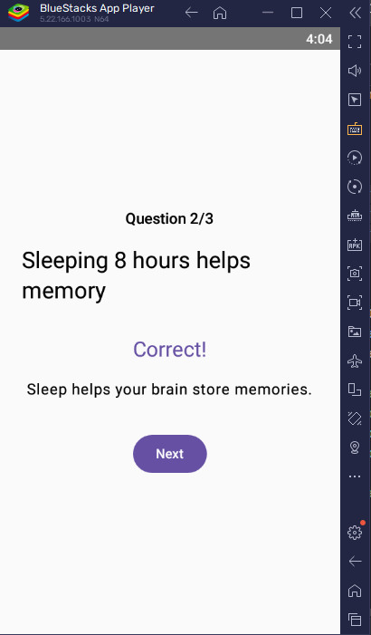

# LifeHackMyth - Quiz App

## 1. App Purpose
LifeHackMyth is an Android quiz app that tests users on common life hack myths. The app has 3 main screens: Welcome, Question, and Score. Users answer 5 questions and get a personalized score with feedback.

## 2. Features
- **Welcome Screen**: Start button to begin the quiz
- **Question Screen**: 5 questions with True/False options, instant feedback, and a "Next" button
- **Score Screen**: Shows final score, personalized feedback, and "Review Answers" button
- **Review Screen**: Displays all questions with correct answers

## 3. Design Considerations
- **User Experience**: Simple navigation with clear buttons. Used `TextView` for questions and `RadioButton` for answers.
- **State Management**: Used `Bundle` to pass score between activities. Used `ArrayList` to store questions.
- **Validation**: Prevents moving to next question without selecting an answer. Shows error if no option selected.

## 4. GitHub & GitHub Actions
This project uses GitHub for version control with regular commits. 
- **Repository**: https://github.com/karenmatsh83-cmd/IMAD5112-LifeHackMyth
- **GitHub Actions**: Automated build on every push to `main` branch. Workflow file is in `.github/workflows/build.yml`
- **Commits**: 4+ commits showing development progress

## 5. Screenshots
<!-- Add screenshots here. Take them on your phone/emulator and drag into GitHub -->
### Welcome Screen

### Question Screen

### Score Screen

## 6. Demo Video
Watch the full app demo here: [YouTube Link]

## 7. How to Run
1. Clone the repo: `git clone https://github.com/karenmatsh83-cmd/IMAD5112-LifeHackMyth`
2. Open in Android Studio
3. Run on emulator or physical device (API 21+)
